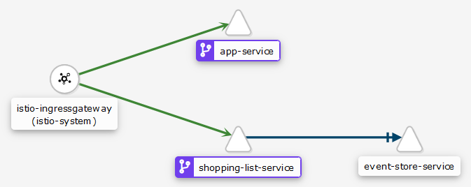

# Meal Planner: Infrastructure

> Infrastructure as Code (IaC) for [Meal Planner project](https://github.com/users/mauvm/projects/1)

This repository contains:

- Kubernetes manifests for the [services](#services)
- Istio profile and manifest

## Services

- [App](https://github.com/mauvm/meal-planner-app-service/): the web interface (UI)
- [List](https://github.com/mauvm/meal-planner-list-service/): the API for managing list items

These services build their own Docker images and push it to a registry that must be accessible to your Kubernetes cluster.

See [`kubernetes/production/kustomization.yml`](kubernetes/production/kustomization.yml) for setting the service versions.

## Architecture

The architecture is simple:

<p align="center">
  
</p>

See [`kubernetes/base/networking/gateway.yml`](kubernetes/base/networking/gateway.yml) for the routing configuration.

Tip: use an [`NGinX Proxy`](#letsencrypt-nginx-proxy-companion) in front of your Istio ingress gateway for automatic SSL certificates.

## Dependencies

## Local Development

Prerequisites for host machine:

- [Minikube v1.13+](https://kubernetes.io/docs/tasks/tools/install-minikube/)
- [Kubectl v1.19+](https://kubernetes.io/docs/tasks/tools/install-kubectl/)
- [Istioctl v1.6.8](https://github.com/istio/istio/releases/)
- [envsubst v0.21+](https://linux.die.net/man/1/envsubst)

Follow the guides above to setup and configure your Minikube cluster.

Start Minikube VM and configure `docker` and `kubectl` commands:

```bash
minikube start
eval $(minikube docker-env) # Or "minikube docker-env | Invoke-Expression" on Windows
kubectl config use-context minikube
```

Next, configure the development environment:

```bash
# envsubst will be used to inject variables/secrets into the Kubernetes manifest,
# because Kustomize only provides limited support for this:
# - secretsGenerator: for using env files, provides secrets for vars
# - vars: copy value from object reference to given field path.
#         Problem: limited to hard coded varreference, unusable for
#         RequestAuthentication in services
# - ReplacementTransformer: didn't get far with Kustomize's docs about plugin usage
cp kubernetes/development/.env.example kubernetes/development/.env
edit kubernetes/development/.env
```

Then setup [Istio](https://istio.io/):

```bash
istioctl install -f istio/profile.yml
istioctl verify-install -f kubernetes/base/networking/istio.generated.yml
```

Before the app can be deployed you need to build the service images:

```bash
cd ../meal-planner-app-service/
docker build -t app-service .

cd ../meal-planner-list-service/
docker build -t list-service .

cd ../meal-planner-infrastructure/
```

Finally deploy the Kubernetes resources and try out the app:

```bash
source kubernetes/development/.env
kubectl kustomize kubernetes/development/ | envsubst | kubectl apply -f -

sudo minikube tunnel

# Test if app is running and accessible
INGRESS_IP=$(kubectl get -n istio-system service/istio-ingressgateway -o jsonpath="{$.spec.clusterIP}")
curl -v "http://$INGRESS_IP"

# Add ingress IP to hosts file
echo -e "\n$INGRESS_IP meal-planner.local" | sudo tee -a /etc/hosts
```

Now open [http://meal-planner.local](http://meal-planner.local) in your browser.

### Helpful commands

```bash
# Get IP address
minikube ip

# Access to Minikube dashboard
minikube dashboard

# Access to Istio's Kiali dashboard
istioctl dashboard kiali # admin:admin

# Set default namespace
kubectl config set-context --current --namespace=meal-planner

# EventStore Admin UI
kubectl port-forward -n meal-planner service/event-store-service 2113:2113 # admin:changeit
```

## Deploy to Production

Deployments to a remote Kubernetes cluster are done with Github Actions.

The Github [`deploy-on-push`](.github/workflows/deploy-on-push.yml) workflow does the following:

1. Install and verify Istio
2. Build Kubernetes manifest and replace environment variables (for improved configurability)
3. Apply manifest to Kubernetes cluster

### Access remote Kubernetes cluster

To access the remote Kubernetes cluster add a Kubectl context:

1. [Generate KUBE_CONFIG_DATA](#github-actions) (base64 encoding is not necessary)
2. Merge into Kubeconfig on host machine (`~/.kube/config`), see example below
3. You can now switch to the remote context: `kubectl config use-context remote-minikube`

```yml
apiVersion: v1
kind: Config
preferences: {}
current-context: minikube
clusters:
  - cluster:
      certificate-authority: /path/to/ca.crt
      server: https://{minikube ip}:8443
    name: minikube
  - cluster:
      insecure-skip-tls-verify: true
      server: https://{server domain}:8443
    name: remote-minikube
contexts:
  - context:
      cluster: minikube
      namespace: meal-planner
      user: minikube
    name: minikube
  - context:
      cluster: remote-minikube
      namespace: meal-planner
      user: remote-minikube
    name: remote-minikube
users:
  - name: minikube
    user:
      client-certificate: ~/.minikube/profiles/minikube/client.crt
      client-key: /.minikube/profiles/minikube/client.key
  - name: remote-minikube
    user:
      client-certificate-data: ...
      client-key-data: ...
```

### Github Actions

For deployments with Github Actions you must configure the following secrets:

- `HOST_DOMAIN`: Domain the app will be hosted on (i.e. `meal-planner-app.eu`)
- `KUBE_CONFIG_DATA_BASE64`: base64 encoded Kubernetes config

  1. Get Kubeconfig: `kubectl config view --flatten --minify > /tmp/kubeconfig.yml`

     See [Configure Access to Multiple Clusters](https://kubernetes.io/docs/tasks/access-application-cluster/configure-access-multiple-clusters/) for Kubeconfig details.

  2. Replace `certificate-authority-data: ...` with `insecure-skip-tls-verify: true`
  3. Replace the server IP to your domain name (path: `clusters/0/cluster/server`)
  4. Encode config: `cat /tmp/kubeconfig.yml | base64`

For configuring Auth0 go to: manage.auth0.com > Applications > {Your App} > Settings.

- `AUTH0_DOMAIN`: Settings > Domain (i.e. `my-app.eu.auth0.com`)
- `AUTH0_DOMAIN_BASE64`: Settings > Domain
- `AUTH0_CLIENT_ID_BASE64`: Settings > Client ID
- `AUTH0_CLIENT_SECRET_BASE64`: Settings > Client Secret
- `AUTH0_AUDIENCE_BASE64`: Auth0 API audience domain, see Auth0 > APIs
- `AUTH0_COOKIE_SECRET_BASE64`: Cookie secret for encrypting cookies (random string of 32 characters)

Configure these secrets for the list service:

- `LIST_INVITE_CODE_SECRET_KEY_BASE64`: Random string of 32 characters (base64 encoded)
- `LIST_INVITE_CODE_INIT_VECTOR_BASE64`: Random string of 32 characters (base64 encoded)

When using the [`letsencrypt-nginx-proxy-companion`](#letsencrypt-nginx-proxy-companion) you should add these secrets as well (optional):

- `LETSENCRYPT_HOST_BASE64`: your domain name
- `LETSENCRYPT_EMAIL_BASE64`: your (developer) email address

Installing Istio on the first run will fail if you do not disable injection for the default namespace. Make sure to run this:

```bash
kubectl label namespace default istio-injection=disabled
```

### Helpful commands

```bash
# Access to remote Minikube dashboard
kubectl port-forward -n kubernetes-dashboard service/kubernetes-dashboard 9000:80
# Note: "uid : unable to do port forwarding: socat not found" port forwarding errors can be resolved by installing socat on the remote machine (yum install socat)

# Access to remote Kiali dashboard
kubectl port-forward -n istio-system service/kiali 9001:20001
```

### LetsEncrypt NGinX Proxy Companion

You can put the [`nginx-proxy`](https://github.com/nginx-proxy/nginx-proxy) in front of your Istio ingress gateway. This allows you to:

- Host other Docker applications on the same server
- Run the [`letsencrypt-nginx-proxy-companion`](https://github.com/nginx-proxy/docker-letsencrypt-nginx-proxy-companion) on the side to automatically request and update LetsEncrypt SSL certificates
